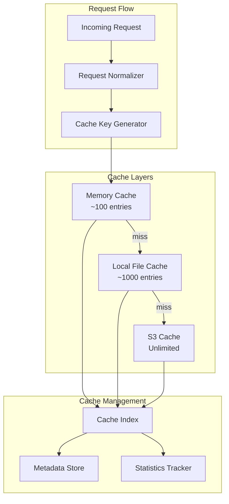

# Caching Strategy

## 🎯 Overview

The caching strategy for MGraph-AI__Service__LLMs is designed to minimize costs, improve performance, and provide audit trails while maintaining data freshness and security.

## 🏗️ Cache Architecture

### Multi-Layer Cache System



## 🔑 Cache Key Generation

### Deterministic Key Algorithm

```python
from osbot_utils.type_safe.Type_Safe import Type_Safe
from osbot_utils.utils.Json import json_md5
from typing import Dict, List, Optional

class Cache__Key_Generator(Type_Safe):
    
    @type_safe
    def generate_key(self, 
                    model: str,
                    messages: List[Dict],
                    temperature: float,
                    max_tokens: Optional[int] = None,
                    functions: Optional[List] = None) -> str:
        """Generate deterministic cache key"""
        
        # Normalize request components
        normalized = {
            "model": model.lower().strip(),
            "messages": self.normalize_messages(messages),
            "temperature": round(temperature, 2),
            "max_tokens": max_tokens,
            "functions": self.normalize_functions(functions)
        }
        
        # Generate hash
        content_hash = json_md5(normalized)[:16]
        
        # Create readable key
        model_short = model.replace('/', '_')[:20]
        cache_key = f"{model_short}_{content_hash}"
        
        return cache_key
    
    @type_safe
    def normalize_messages(self, messages: List[Dict]) -> List[Dict]:
        """Normalize messages for consistent hashing"""
        normalized = []
        for msg in messages:
            normalized.append({
                "role": msg["role"].lower().strip(),
                "content": self.normalize_content(msg["content"])
            })
        return normalized
    
    @type_safe
    def normalize_content(self, content: str) -> str:
        """Normalize content for consistent hashing"""
        # Remove extra whitespace
        content = ' '.join(content.split())
        # Lowercase for case-insensitive matching
        return content.lower()
```

## 📁 S3 Storage Structure

### Temporal Organization

```
s3://mgraph-ai-llm-cache/
├── llm-cache/
│   ├── {model}/
│   │   ├── {year}/
│   │   │   ├── {month}/
│   │   │   │   ├── {day}/
│   │   │   │   │   ├── {hour}/
│   │   │   │   │   │   ├── {cache_id}.json
│   │   │   │   │   │   └── {cache_id}.metadata.json
├── cache-index/
│   ├── by-hash/
│   │   └── {hash_prefix}/
│   │       └── {full_hash}.json
│   ├── by-date/
│   │   └── {year}-{month}-{day}.json
│   └── global/
│       ├── cache_index.json
│       └── statistics.json
```

### Cache Entry Schema

```python
class Schema__Cache_Entry(Type_Safe):
    # Identity
    cache_id: str
    cache_key: str
    request_hash: str
    
    # Request data
    request: Schema__LLM_Request
    request_timestamp: datetime
    
    # Response data
    response: Schema__LLM_Response
    response_timestamp: datetime
    
    # Metadata
    model: str
    platform: str
    provider: str
    tokens: Dict[str, int]  # input, output
    cost: Dict[str, float]  # input, output, total
    latency_ms: float
    
    # Cache metadata
    hit_count: int = 0
    last_accessed: datetime
    expires_at: Optional[datetime] = None
    tags: List[str] = []
```

## 🔄 Cache Operations

### Write-Through Cache

```python
class Cache__Manager(Type_Safe):
    
    @type_safe
    async def get_or_execute(self, 
                            request: Schema__LLM_Request,
                            executor: Callable) -> Schema__LLM_Response:
        """Get from cache or execute and cache"""
        
        # Generate cache key
        cache_key = self.key_generator.generate_key(
            model=request.model,
            messages=request.messages,
            temperature=request.temperature,
            max_tokens=request.max_tokens
        )
        
        # Check cache layers
        cached = await self.check_cache(cache_key)
        if cached:
            await self.update_hit_stats(cache_key)
            return cached
        
        # Execute request
        response = await executor(request)
        
        # Cache response
        await self.cache_response(cache_key, request, response)
        
        return response
    
    @type_safe
    async def check_cache(self, cache_key: str) -> Optional[Schema__LLM_Response]:
        """Check all cache layers"""
        
        # L1: Memory cache
        if cached := self.memory_cache.get(cache_key):
            return cached
        
        # L2: Local file cache
        if cached := self.local_cache.get(cache_key):
            self.memory_cache.set(cache_key, cached)
            return cached
        
        # L3: S3 cache
        if cached := await self.s3_cache.get(cache_key):
            self.local_cache.set(cache_key, cached)
            self.memory_cache.set(cache_key, cached)
            return cached
        
        return None
```

### Cache Invalidation

```python
class Cache__Invalidator(Type_Safe):
    
    @type_safe
    def invalidate_by_model(self, model: str) -> int:
        """Invalidate all cache entries for a model"""
        entries = self.index.find_by_model(model)
        
        for entry in entries:
            self.mark_invalid(entry.cache_id)
        
        return len(entries)
    
    @type_safe
    def invalidate_by_age(self, older_than: datetime) -> int:
        """Invalidate entries older than specified date"""
        entries = self.index.find_older_than(older_than)
        
        for entry in entries:
            self.mark_invalid(entry.cache_id)
        
        return len(entries)
    
    @type_safe
    def invalidate_by_pattern(self, pattern: str) -> int:
        """Invalidate entries matching pattern"""
        entries = self.index.find_by_pattern(pattern)
        
        for entry in entries:
            self.mark_invalid(entry.cache_id)
        
        return len(entries)
```

## 📊 Cache Policies

### TTL Strategy

```python
class Cache__TTL_Policy(Type_Safe):
    
    # Model-specific TTLs (in hours)
    model_ttls = {
        "gpt-5-nano": 168,      # 1 week - stable model
        "gpt-5-mini": 168,      # 1 week
        "mistral-*": 336,       # 2 weeks - very stable
        "llama-*": 720,         # 1 month - local models
        "*-preview": 24,        # 1 day - preview models
        "*-beta": 12,           # 12 hours - beta models
    }
    
    # Content-based TTLs
    content_ttls = {
        "factual": 720,         # 1 month
        "creative": 168,        # 1 week
        "realtime": 1,          # 1 hour
        "personal": 24,         # 1 day
    }
    
    @type_safe
    def calculate_ttl(self, request: Schema__LLM_Request) -> int:
        """Calculate TTL based on model and content"""
        
        # Get base TTL from model
        model_ttl = self.get_model_ttl(request.model)
        
        # Adjust based on content type
        content_type = self.detect_content_type(request)
        content_ttl = self.content_ttls.get(content_type, 168)
        
        # Use minimum of both
        return min(model_ttl, content_ttl)
```

### Eviction Policy

```python
class Cache__Eviction_Policy(Type_Safe):
    
    @type_safe
    def evict_lru(self, max_entries: int):
        """Least Recently Used eviction"""
        entries = self.index.get_all_sorted_by_access()
        
        if len(entries) > max_entries:
            to_evict = entries[max_entries:]
            for entry in to_evict:
                self.evict_entry(entry)
    
    @type_safe
    def evict_by_cost_efficiency(self, target_size_gb: float):
        """Evict based on cost/benefit ratio"""
        entries = self.index.get_all_with_stats()
        
        # Calculate cost efficiency
        for entry in entries:
            entry.efficiency = (
                entry.cost_saved / 
                (entry.size_mb / 1024)
            )
        
        # Sort by efficiency (lowest first)
        entries.sort(key=lambda e: e.efficiency)
        
        # Evict until under target size
        current_size = self.get_total_size_gb()
        for entry in entries:
            if current_size <= target_size_gb:
                break
            self.evict_entry(entry)
            current_size -= entry.size_mb / 1024
```

## 🔍 Cache Analytics

### Performance Metrics

```python
class Cache__Analytics(Type_Safe):
    
    @type_safe
    def calculate_metrics(self) -> Dict:
        """Calculate cache performance metrics"""
        
        return {
            "hit_rate": self.calculate_hit_rate(),
            "cost_saved": self.calculate_cost_saved(),
            "avg_latency_saved": self.calculate_latency_saved(),
            "storage_efficiency": self.calculate_storage_efficiency(),
            "hot_keys": self.get_hot_keys(top_n=10),
            "cold_keys": self.get_cold_keys(top_n=10),
            "by_model": self.get_metrics_by_model(),
            "by_platform": self.get_metrics_by_platform(),
            "trends": self.calculate_trends()
        }
    
    @type_safe
    def calculate_hit_rate(self) -> float:
        """Calculate overall cache hit rate"""
        total_requests = self.stats.total_requests
        cache_hits = self.stats.cache_hits
        
        if total_requests == 0:
            return 0.0
        
        return cache_hits / total_requests
    
    @type_safe
    def calculate_cost_saved(self) -> Dict[str, float]:
        """Calculate cost saved by caching"""
        cost_saved = 0.0
        
        for entry in self.index.get_all():
            if entry.hit_count > 0:
                # Cost saved = (hits - 1) * original cost
                saved = (entry.hit_count - 1) * entry.cost["total"]
                cost_saved += saved
        
        return {
            "total": cost_saved,
            "daily_average": cost_saved / self.days_active,
            "per_request": cost_saved / self.stats.cache_hits if self.stats.cache_hits > 0 else 0
        }
```

### Usage Patterns

```python
class Cache__Usage_Patterns(Type_Safe):
    
    @type_safe
    def analyze_patterns(self) -> Dict:
        """Analyze cache usage patterns"""
        
        return {
            "temporal": self.analyze_temporal_patterns(),
            "model_distribution": self.analyze_model_distribution(),
            "prompt_categories": self.categorize_prompts(),
            "user_patterns": self.analyze_user_patterns(),
            "optimization_opportunities": self.find_optimizations()
        }
    
    @type_safe
    def analyze_temporal_patterns(self) -> Dict:
        """Analyze when cache is most effective"""
        
        hourly_hits = defaultdict(int)
        hourly_misses = defaultdict(int)
        
        for event in self.get_events():
            hour = event.timestamp.hour
            if event.cache_hit:
                hourly_hits[hour] += 1
            else:
                hourly_misses[hour] += 1
        
        return {
            "peak_hours": self.find_peak_hours(hourly_hits),
            "low_activity": self.find_low_activity(hourly_hits),
            "best_hit_rate_hours": self.calculate_hourly_hit_rates(hourly_hits, hourly_misses),
            "weekly_patterns": self.analyze_weekly_patterns()
        }
    
    @type_safe
    def find_optimizations(self) -> List[Dict]:
        """Find cache optimization opportunities"""
        optimizations = []
        
        # Find duplicate requests with slight variations
        similar_requests = self.find_similar_requests()
        if similar_requests:
            optimizations.append({
                "type": "normalize_prompts",
                "impact": "high",
                "description": f"Found {len(similar_requests)} similar requests that could share cache",
                "potential_savings": self.calculate_normalization_savings(similar_requests)
            })
        
        # Find models with low cache hit rates
        low_hit_models = self.find_low_hit_rate_models()
        for model in low_hit_models:
            optimizations.append({
                "type": "adjust_ttl",
                "model": model["name"],
                "current_hit_rate": model["hit_rate"],
                "suggested_ttl": model["suggested_ttl"],
                "impact": "medium"
            })
        
        return optimizations
```

## 🔒 Cache Security

### Data Protection

```python
class Cache__Security(Type_Safe):
    
    @type_safe
    def encrypt_cache_entry(self, entry: Schema__Cache_Entry) -> bytes:
        """Encrypt sensitive cache data"""
        # Encrypt PII and sensitive content
        sensitive_fields = ["messages", "response", "user_id"]
        
        encrypted_entry = entry.copy()
        for field in sensitive_fields:
            if hasattr(encrypted_entry, field):
                value = getattr(encrypted_entry, field)
                encrypted_value = self.encrypt_field(value)
                setattr(encrypted_entry, field, encrypted_value)
        
        return encrypted_entry.to_bytes()
    
    @type_safe
    def sanitize_for_logging(self, entry: Schema__Cache_Entry) -> Dict:
        """Sanitize cache entry for logging"""
        return {
            "cache_id": entry.cache_id,
            "model": entry.model,
            "timestamp": entry.request_timestamp,
            "tokens": entry.tokens,
            "cost": entry.cost,
            "hit_count": entry.hit_count,
            # Exclude actual content
        }
```

### Access Control

```python
class Cache__Access_Control(Type_Safe):
    
    @type_safe
    def can_access_cache(self, user_id: str, cache_id: str) -> bool:
        """Check if user can access cache entry"""
        entry = self.get_entry_metadata(cache_id)
        
        # Check ownership
        if entry.user_id == user_id:
            return True
        
        # Check shared access
        if user_id in entry.shared_with:
            return True
        
        # Check role-based access
        user_role = self.get_user_role(user_id)
        if user_role in ["admin", "cache_manager"]:
            return True
        
        return False
```

## 🚀 Cache Optimization

### Preemptive Caching

```python
class Cache__Preemptive(Type_Safe):
    
    @type_safe
    def identify_cacheable_patterns(self) -> List[Dict]:
        """Identify patterns worth pre-caching"""
        patterns = []
        
        # Find frequently used prompts
        frequent = self.find_frequent_prompts(min_count=10)
        for prompt_pattern in frequent:
            patterns.append({
                "type": "frequent",
                "pattern": prompt_pattern,
                "frequency": prompt_pattern.count,
                "models": prompt_pattern.models_used
            })
        
        # Find time-based patterns
        scheduled = self.find_scheduled_patterns()
        for schedule_pattern in scheduled:
            patterns.append({
                "type": "scheduled",
                "pattern": schedule_pattern,
                "schedule": schedule_pattern.cron,
                "next_run": schedule_pattern.next_occurrence
            })
        
        return patterns
    
    @type_safe
    async def precache_pattern(self, pattern: Dict):
        """Pre-cache a pattern"""
        if pattern["type"] == "frequent":
            # Cache with all commonly used models
            for model in pattern["models"]:
                request = self.build_request(pattern["pattern"], model)
                await self.execute_and_cache(request)
        
        elif pattern["type"] == "scheduled":
            # Schedule for execution
            self.scheduler.add_job(
                self.execute_and_cache,
                trigger="cron",
                args=[pattern["pattern"]],
                **pattern["schedule"]
            )
```

### Cache Warming

```python
class Cache__Warmer(Type_Safe):
    
    @type_safe
    async def warm_cache(self, strategy: str = "popular"):
        """Warm cache based on strategy"""
        
        if strategy == "popular":
            # Warm with most popular requests
            popular = self.get_popular_requests(top_n=100)
            for request in popular:
                await self.warm_request(request)
        
        elif strategy == "expired":
            # Re-warm recently expired entries
            expired = self.get_recently_expired(hours=24)
            for entry in expired:
                if entry.hit_count > 5:  # Only re-warm if it was useful
                    await self.warm_request(entry.request)
        
        elif strategy == "predicted":
            # Use ML to predict future requests
            predictions = self.predict_future_requests()
            for predicted_request in predictions:
                await self.warm_request(predicted_request)
    
    @type_safe
    async def warm_request(self, request: Schema__LLM_Request):
        """Warm a single request"""
        # Check if already cached
        cache_key = self.generate_key(request)
        if not await self.exists(cache_key):
            # Execute and cache
            response = await self.execute_request(request)
            await self.cache_response(cache_key, request, response)
```

## 📈 Cache Monitoring

### Real-time Metrics

```python
class Cache__Monitor(Type_Safe):
    
    @type_safe
    def get_realtime_metrics(self) -> Dict:
        """Get real-time cache metrics"""
        
        return {
            "current": {
                "total_entries": self.count_entries(),
                "total_size_gb": self.calculate_size_gb(),
                "memory_entries": self.memory_cache.size(),
                "local_entries": self.local_cache.size(),
                "s3_entries": self.s3_cache.count()
            },
            "rates": {
                "hits_per_minute": self.calculate_rate("hits", minutes=1),
                "misses_per_minute": self.calculate_rate("misses", minutes=1),
                "writes_per_minute": self.calculate_rate("writes", minutes=1),
                "evictions_per_minute": self.calculate_rate("evictions", minutes=1)
            },
            "performance": {
                "avg_hit_latency_ms": self.avg_latency("hit"),
                "avg_miss_latency_ms": self.avg_latency("miss"),
                "avg_write_latency_ms": self.avg_latency("write")
            },
            "alerts": self.check_alerts()
        }
    
    @type_safe
    def check_alerts(self) -> List[Dict]:
        """Check for cache alerts"""
        alerts = []
        
        # Low hit rate alert
        hit_rate = self.calculate_hit_rate()
        if hit_rate < 0.2:
            alerts.append({
                "severity": "warning",
                "type": "low_hit_rate",
                "message": f"Cache hit rate is {hit_rate:.1%}",
                "suggested_action": "Review cache key generation"
            })
        
        # High eviction rate
        eviction_rate = self.calculate_rate("evictions", minutes=5)
        if eviction_rate > 10:
            alerts.append({
                "severity": "warning",
                "type": "high_eviction",
                "message": f"Evicting {eviction_rate} entries/min",
                "suggested_action": "Increase cache size or adjust TTL"
            })
        
        # Storage nearly full
        usage_percent = self.get_storage_usage_percent()
        if usage_percent > 90:
            alerts.append({
                "severity": "critical",
                "type": "storage_full",
                "message": f"Cache storage at {usage_percent}%",
                "suggested_action": "Immediate cleanup required"
            })
        
        return alerts
```

### Dashboard Metrics

```python
class Cache__Dashboard(Type_Safe):
    
    @type_safe
    def get_dashboard_data(self) -> Dict:
        """Get comprehensive dashboard data"""
        
        return {
            "summary": {
                "total_requests": self.stats.total_requests,
                "cache_hits": self.stats.cache_hits,
                "hit_rate": f"{self.calculate_hit_rate():.1%}",
                "total_cost_saved": f"${self.calculate_cost_saved()['total']:.2f}",
                "avg_response_time": f"{self.avg_latency('all'):.0f}ms"
            },
            "charts": {
                "hit_rate_trend": self.get_hit_rate_trend(days=7),
                "cost_saved_daily": self.get_cost_saved_daily(days=30),
                "requests_by_model": self.get_requests_by_model(),
                "cache_size_trend": self.get_size_trend(days=7)
            },
            "top_lists": {
                "models": self.get_top_models(5),
                "prompts": self.get_top_prompts(10),
                "users": self.get_top_users(5)
            },
            "recommendations": self.get_recommendations()
        }
```

## 🔧 Cache Configuration

### Environment Variables

```yaml
# Cache configuration
CACHE_ENABLED: true
CACHE_S3_BUCKET: mgraph-ai-llm-cache
CACHE_S3_REGION: us-east-1

# Cache layers
CACHE_MEMORY_SIZE: 100
CACHE_LOCAL_SIZE: 1000
CACHE_LOCAL_PATH: /tmp/llm-cache

# TTL settings (hours)
CACHE_DEFAULT_TTL: 168
CACHE_MIN_TTL: 1
CACHE_MAX_TTL: 720

# Eviction settings
CACHE_MAX_SIZE_GB: 100
CACHE_EVICTION_STRATEGY: lru
CACHE_EVICTION_THRESHOLD: 0.9

# Performance
CACHE_COMPRESSION: true
CACHE_ENCRYPTION: false
CACHE_ASYNC_WRITES: true

# Monitoring
CACHE_METRICS_ENABLED: true
CACHE_METRICS_INTERVAL: 60
CACHE_ALERT_EMAIL: cache-alerts@example.com
```

### Cache Policy Configuration

```python
class Cache__Config(Type_Safe):
    # Layer configurations
    memory_cache: Dict = {
        "enabled": True,
        "max_entries": 100,
        "ttl_seconds": 300
    }
    
    local_cache: Dict = {
        "enabled": True,
        "max_entries": 1000,
        "ttl_seconds": 3600,
        "path": "/tmp/llm-cache"
    }
    
    s3_cache: Dict = {
        "enabled": True,
        "bucket": "mgraph-ai-llm-cache",
        "region": "us-east-1",
        "ttl_hours": 168,
        "compression": True
    }
    
    # Policies
    policies: Dict = {
        "normalize_prompts": True,
        "ignore_temperature_below": 0.1,
        "cache_errors": False,
        "cache_functions": True,
        "min_tokens_to_cache": 10,
        "max_response_size_mb": 10
    }
```

## 📊 Cache ROI Analysis

```python
class Cache__ROI(Type_Safe):
    
    @type_safe
    def calculate_roi(self, period_days: int = 30) -> Dict:
        """Calculate cache return on investment"""
        
        # Costs
        storage_cost = self.calculate_storage_cost(period_days)
        compute_cost = self.calculate_compute_cost(period_days)
        total_cost = storage_cost + compute_cost
        
        # Savings
        api_cost_saved = self.calculate_api_savings(period_days)
        time_saved_value = self.calculate_time_value(period_days)
        total_savings = api_cost_saved + time_saved_value
        
        # ROI
        roi = ((total_savings - total_cost) / total_cost) * 100 if total_cost > 0 else 0
        
        return {
            "costs": {
                "storage": storage_cost,
                "compute": compute_cost,
                "total": total_cost
            },
            "savings": {
                "api_costs": api_cost_saved,
                "time_value": time_saved_value,
                "total": total_savings
            },
            "roi_percent": roi,
            "break_even_days": self.calculate_break_even(total_cost, total_savings, period_days),
            "recommendations": self.get_roi_recommendations(roi)
        }
```