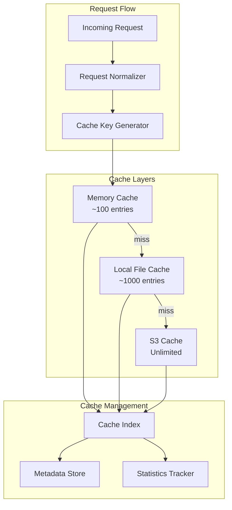

# Caching Strategy

## 🎯 Overview

The caching strategy for MGraph-AI__Service__LLMs is designed to minimize costs, improve performance, and provide audit trails while maintaining data freshness and security.

## 🏗️ Cache Architecture

### Multi-Layer Cache System



## 🔑 Cache Key Generation

### Deterministic Key Algorithm

```python
from osbot_utils.type_safe.Type_Safe import Type_Safe
from osbot_utils.utils.Json import json_md5
from typing import Dict, List, Optional

class Cache__Key_Generator(Type_Safe):
    
    @type_safe
    def generate_key(self, 
                    model: str,
                    messages: List[Dict],
                    temperature: float,
                    max_tokens: Optional[int] = None,
                    functions: Optional[List] = None) -> str:
        """Generate deterministic cache key"""
        
        # Normalize request components
        normalized = {
            "model": model.lower().strip(),
            "messages": self.normalize_messages(messages),
            "temperature": round(temperature, 2),
            "max_tokens": max_tokens,
            "functions": self.normalize_functions(functions)
        }
        
        # Generate hash
        content_hash = json_md5(normalized)[:16]
        
        # Create readable key
        model_short = model.replace('/', '_')[:20]
        cache_key = f"{model_short}_{content_hash}"
        
        return cache_key
    
    @type_safe
    def normalize_messages(self, messages: List[Dict]) -> List[Dict]:
        """Normalize messages for consistent hashing"""
        normalized = []
        for msg in messages:
            normalized.append({
                "role": msg["role"].lower().strip(),
                "content": self.normalize_content(msg["content"])
            })
        return normalized
    
    @type_safe
    def normalize_content(self, content: str) -> str:
        """Normalize content for consistent hashing"""
        # Remove extra whitespace
        content = ' '.join(content.split())
        # Lowercase for case-insensitive matching
        return content.lower()
```

## 📁 S3 Storage Structure

### Temporal Organization

```
s3://mgraph-ai-llm-cache/
├── llm-cache/
│   ├── {model}/
│   │   ├── {year}/
│   │   │   ├── {month}/
│   │   │   │   ├── {day}/
│   │   │   │   │   ├── {hour}/
│   │   │   │   │   │   ├── {cache_id}.json
│   │   │   │   │   │   └── {cache_id}.metadata.json
├── cache-index/
│   ├── by-hash/
│   │   └── {hash_prefix}/
│   │       └── {full_hash}.json
│   ├── by-date/
│   │   └── {year}-{month}-{day}.json
│   └── global/
│       ├── cache_index.json
│       └── statistics.json
```

### Cache Entry Schema

```python
class Schema__Cache_Entry(Type_Safe):
    # Identity
    cache_id: str
    cache_key: str
    request_hash: str
    
    # Request data
    request: Schema__LLM_Request
    request_timestamp: datetime
    
    # Response data
    response: Schema__LLM_Response
    response_timestamp: datetime
    
    # Metadata
    model: str
    platform: str
    provider: str
    tokens: Dict[str, int]  # input, output
    cost: Dict[str, float]  # input, output, total
    latency_ms: float
    
    # Cache metadata
    hit_count: int = 0
    last_accessed: datetime
    expires_at: Optional[datetime] = None
    tags: List[str] = []
```

## 🔄 Cache Operations

### Write-Through Cache

```python
class Cache__Manager(Type_Safe):
    
    @type_safe
    async def get_or_execute(self, 
                            request: Schema__LLM_Request,
                            executor: Callable) -> Schema__LLM_Response:
        """Get from cache or execute and cache"""
        
        # Generate cache key
        cache_key = self.key_generator.generate_key(
            model=request.model,
            messages=request.messages,
            temperature=request.temperature,
            max_tokens=request.max_tokens
        )
        
        # Check cache layers
        cached = await self.check_cache(cache_key)
        if cached:
            await self.update_hit_stats(cache_key)
            return cached
        
        # Execute request
        response = await executor(request)
        
        # Cache response
        await self.cache_response(cache_key, request, response)
        
        return response
    
    @type_safe
    async def check_cache(self, cache_key: str) -> Optional[Schema__LLM_Response]:
        """Check all cache layers"""
        
        # L1: Memory cache
        if cached := self.memory_cache.get(cache_key):
            return cached
        
        # L2: Local file cache
        if cached := self.local_cache.get(cache_key):
            self.memory_cache.set(cache_key, cached)
            return cached
        
        # L3: S3 cache
        if cached := await self.s3_cache.get(cache_key):
            self.local_cache.set(cache_key, cached)
            self.memory_cache.set(cache_key, cached)
            return cached
        
        return None
```

### Cache Invalidation

```python
class Cache__Invalidator(Type_Safe):
    
    @type_safe
    def invalidate_by_model(self, model: str) -> int:
        """Invalidate all cache entries for a model"""
        entries = self.index.find_by_model(model)
        
        for entry in entries:
            self.mark_invalid(entry.cache_id)
        
        return len(entries)
    
    @type_safe
    def invalidate_by_age(self, older_than: datetime) -> int:
        """Invalidate entries older than specified date"""
        entries = self.index.find_older_than(older_than)
        
        for entry in entries:
            self.mark_invalid(entry.cache_id)
        
        return len(entries)
    
    @type_safe
    def invalidate_by_pattern(self, pattern: str) -> int:
        """Invalidate entries matching pattern"""
        entries = self.index.find_by_pattern(pattern)
        
        for entry in entries:
            self.mark_invalid(entry.cache_id)
        
        return len(entries)
```

## 🔍 Cache Analytics

### Performance Metrics

```python
class Cache__Analytics(Type_Safe):
    
    @type_safe
    def calculate_metrics(self) -> Dict:
        """Calculate cache performance metrics"""
        
        return {
            "hit_rate": self.calculate_hit_rate(),
            "cost_saved": self.calculate_cost_saved(),
            "avg_latency_saved": self.calculate_latency_saved(),
            "storage_efficiency": self.calculate_storage_efficiency(),
            "hot_keys": self.get_hot_keys(top_n=10),
            "cold_keys": self.get_cold_keys(top_n=10),
            "by_model": self.get_metrics_by_model(),
            "by_platform": self.get_metrics_by_platform(),
            "trends": self.calculate_trends()
        }
    
    @type_safe
    def calculate_hit_rate(self) -> float:
        """Calculate overall cache hit rate"""
        total_requests = self.stats.total_requests
        cache_hits = self.stats.cache_hits
        
        if total_requests == 0:
            return 0.0
        
        return cache_hits / total_requests
    
    @type_safe
    def calculate_cost_saved(self) -> Dict[str, float]:
        """Calculate cost saved by caching"""
        cost_saved = 0.0
        
        for entry in self.index.get_all():
            if entry.hit_count > 0:
                # Cost saved = (hits - 1) * original cost
                saved = (entry.hit_count - 1) * entry.cost["total"]
                cost_saved += saved
        
        return {
            "total": cost_saved,
            "daily_average": cost_saved / self.days_active,
            "per_request": cost_saved / self.stats.cache_hits if self.stats.cache_hits > 0 else 0
        }
```

### Usage Patterns

```python
class Cache__Usage_Patterns(Type_Safe):
    
    @type_safe
    def analyze_patterns(self) -> Dict:
        """Analyze cache usage patterns"""
        
        return {
            "temporal": self.analyze_temporal_patterns(),
            "model_distribution": self.analyze_model_distribution(),
            "prompt_categories": self.categorize_prompts(),
            "user_patterns": self.analyze_user_patterns(),
            "optimization_opportunities": self.find_optimizations()
        }
    
    @type_safe
    def analyze_temporal_patterns(self) -> Dict:
        """Analyze when cache is most effective"""
        
        hourly_hits = defaultdict(int)
        hourly_misses = defaultdict(int)
        
        for event in self.get_events():
            hour = event.timestamp.hour
            if event.cache_hit:
                hourly_hits[hour] += 1
            else:
                hourly_misses[hour] += 1
        
        return {
            "peak_hours": self.find_peak_hours(hourly_hits),
            "low_activity": self.find_low_activity(hourly_hits),
            "best_hit_rate_hours": self.calculate_hourly_hit_rates(hourly_hits, hourly_misses),
            "weekly_patterns": self.analyze_weekly_patterns()
        }
    
    @type_safe
    def find_optimizations(self) -> List[Dict]:
        """Find cache optimization opportunities"""
        optimizations = []
        
        # Find duplicate requests with slight variations
        similar_requests = self.find_similar_requests()
        if similar_requests:
            optimizations.append({
                "type": "normalize_prompts",
                "impact": "high",
                "description": f"Found {len(similar_requests)} similar requests that could share cache",
                "potential_savings": self.calculate_normalization_savings(similar_requests)
            })
        
        # Find models with low cache hit rates
        low_hit_models = self.find_low_hit_rate_models()
        for model in low_hit_models:
            optimizations.append({
                "type": "adjust_ttl",
                "model": model["name"],
                "current_hit_rate": model["hit_rate"],
                "suggested_ttl": model["suggested_ttl"],
                "impact": "medium"
            })
        
        return optimizations
```

## 🔧 Cache Configuration

### Environment Variables

```yaml
# Cache configuration
CACHE_ENABLED: true
CACHE_S3_BUCKET: mgraph-ai-llm-cache
CACHE_S3_REGION: us-east-1


# Performance
CACHE_COMPRESSION: true
CACHE_ENCRYPTION: false
CACHE_ASYNC_WRITES: true

# Monitoring
CACHE_METRICS_ENABLED: true
CACHE_METRICS_INTERVAL: 60
CACHE_ALERT_EMAIL: cache-alerts@example.com
```