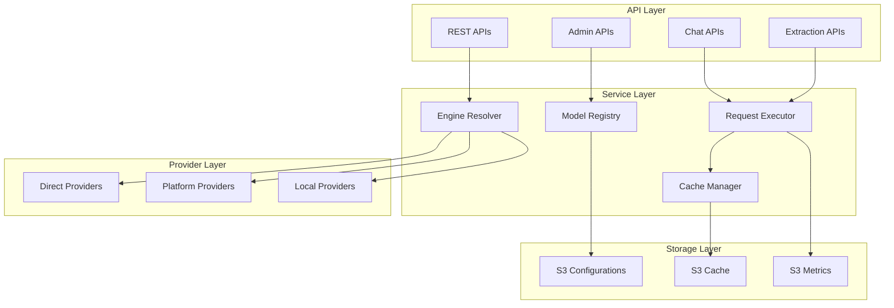

# MGraph-AI__Service__LLMs - Core Principles and Architecture

## 🎯 Vision

MGraph-AI__Service__LLMs is a Type-Safe LLM service that provides a unified interface to multiple LLM platforms, providers, and models while maintaining strong typing, comprehensive caching, and enterprise-grade monitoring.

## 🏗️ Core Principles

### 1. Platform → Provider → Model Hierarchy

The service follows a three-tier hierarchy that reflects the reality of the LLM ecosystem:

```
Platform (OpenRouter, Direct, Local)
    └── Provider (OpenAI, Mistral AI, Meta, Google)
            └── Model (GPT-5-nano, Mistral-Small, Llama-3)
```

**Examples:**
- **OpenRouter** (Platform) → **OpenAI** (Provider) → **GPT-5-mini** (Model)
- **Direct** (Platform) → **Mistral AI** (Provider) → **Mistral-Small** (Model)
- **Local** (Platform) → **Ollama** (Provider) → **Llama-3** (Model)

### 2. Open Router Model

Support multiple pathways to access the same model:
- **Direct to Provider**: Call OpenAI API directly
- **Via Platform**: Route through OpenRouter for unified billing
- **Local Deployment**: Use Ollama for on-premise hosting
- **Fallback Chains**: Automatic failover between routes

### 3. OpenAI Format as Standard with Extensions

- **Base Format**: OpenAI's chat completion API as the industry standard
- **Provider Extensions**: Support provider-specific features (e.g., Mistral's function calling)
- **Platform Extensions**: Leverage platform features (e.g., OpenRouter's unified billing)
- **Model Extensions**: Utilize model-specific capabilities (e.g., vision, audio)

### 4. API-First Design

Every capability exposed through REST APIs:
- **Service Layer**: Business logic encapsulated in services
- **API Layer**: Thin REST wrapper around services
- **Type-Safe Contracts**: All APIs use Type_Safe schemas
- **Auto-documentation**: OpenAPI/Swagger generated from Type_Safe

### 5. Comprehensive Model Management

Dynamic, API-driven model registry:
- **CRUD Operations**: Add, edit, delete, view models via API
- **S3 Storage**: Persistent storage of model configurations
- **Cost Tracking**: Per-token pricing for all models
- **Capability Matrix**: Track features per model (vision, streaming, etc.)

### 6. Multiple Input/Output Patterns

Support various interaction patterns:

| Pattern | Input | Output | Use Case |
|---------|-------|--------|----------|
| **Text → Text** | String | String | Simple queries |
| **Text → Schema** | String | Type_Safe | Structured extraction |
| **Schema → Text** | Type_Safe | String | Template generation |
| **Schema → Schema** | Type_Safe | Type_Safe | Data transformation |
| **Batch → Batch** | List[Type_Safe] | List[Type_Safe] | Bulk processing |

### 7. Type_Safe Throughout

Leverage OSBot-Utils Type_Safe for:
- **Request/Response Schemas**: Strong typing at boundaries
- **Model Configurations**: Validated model definitions
- **Cache Keys**: Type-safe cache key generation
- **API Contracts**: Auto-conversion with FastAPI

### 8. Universal Caching

All LLM requests cached with:
- **Content-based Keys**: Deterministic cache key generation
- **S3 Backend**: Scalable, persistent storage
- **Temporal Organization**: Time-based folder structure
- **Cost Savings**: Avoid redundant API calls

## 🏛️ High-Level Architecture



## 📋 Design Decisions

### Why Platform → Provider → Model?

This three-tier model reflects reality:
- **Platforms** aggregate multiple providers (OpenRouter, AWS Bedrock)
- **Providers** create and host models (OpenAI, Anthropic)
- **Models** are the actual LLMs with specific capabilities

### Why S3 for Configuration?

- **Versioning**: Track changes over time
- **Backup**: Automatic backups via S3 versioning
- **Distribution**: Easy replication across regions
- **Cost-effective**: Cheaper than database for blob storage
- **Integration**: Works with existing S3 cache

### Why Type_Safe?

- **Runtime Validation**: Catch errors before expensive API calls
- **Auto-conversion**: Seamless FastAPI integration
- **Documentation**: Self-documenting schemas
- **Testing**: Type-safe test data generation

### Why Universal Caching?

- **Cost Reduction**: LLM APIs are expensive
- **Performance**: Instant responses for cached requests
- **Development**: Faster iteration during development
- **Compliance**: Audit trail of all LLM interactions

## 🚀 Implementation Priorities

### Phase 1: Core Infrastructure (Week 1)
1. Port Platform Engine architecture from CBR Athena
2. Implement Model Registry with S3 backend
3. Set up Type_Safe schemas for all entities
4. Create base REST API structure

### Phase 2: Provider Integration (Week 2)
1. OpenRouter (multiple models, free & paid)
2. OpenAI (reference, audio support)
3. Groq (fast, free tier)
4. Ollama (local deployment)

### Phase 3: Advanced Features (Week 3)
1. Schema input/output endpoints
2. Batch processing APIs
3. Cost tracking and analytics
4. Admin UI for model management

### Phase 4: Production Hardening (Week 4)
1. Comprehensive error handling
2. Rate limiting and quotas
3. Monitoring and alerting
4. Performance optimization

## 🔑 Key Differentiators

1. **True Multi-Route**: Same model accessible via multiple paths
2. **Type-Safe Throughout**: Not just at boundaries, but everywhere
3. **Model Registry**: Dynamic, API-driven model management
4. **Cost-Aware**: Built-in cost tracking and optimization
5. **Production-Ready**: Caching, monitoring, error handling built-in

## 📚 Related Documentation

- [Model Registry Design](./model-registry-design.md)
- [API Endpoints Specification](./api-endpoints-spec.md)
- [Provider Integration Guide](./provider-integration-guide.md)
- [Caching Strategy](./caching-strategy.md)